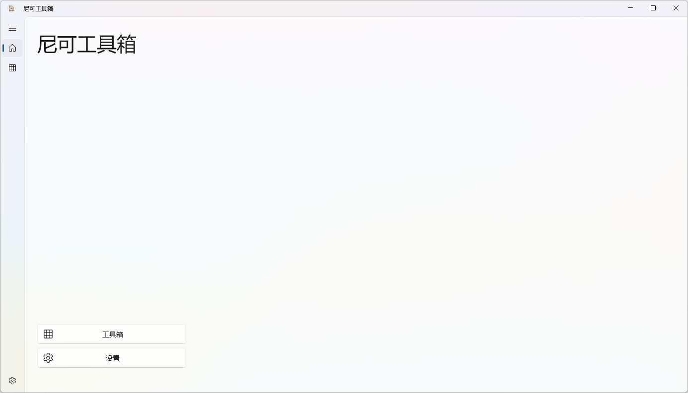
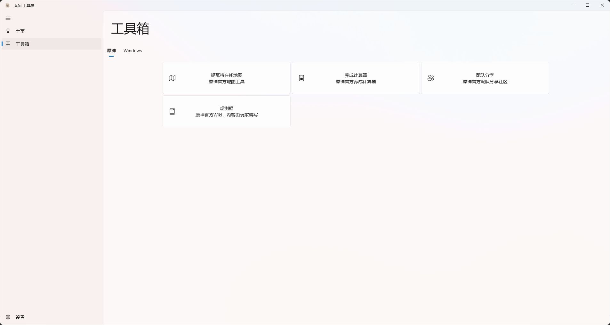
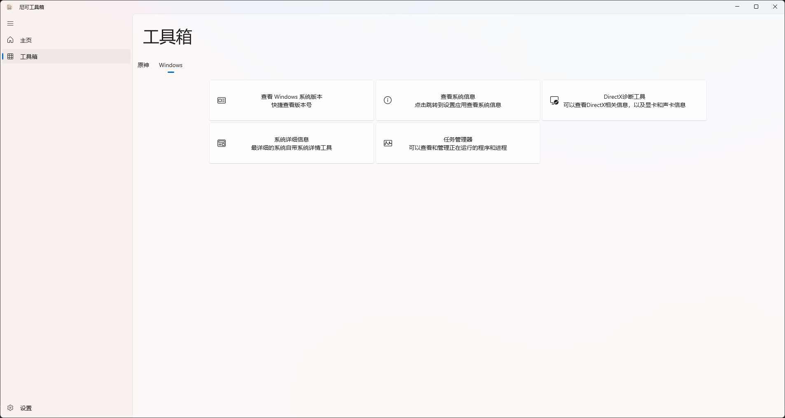
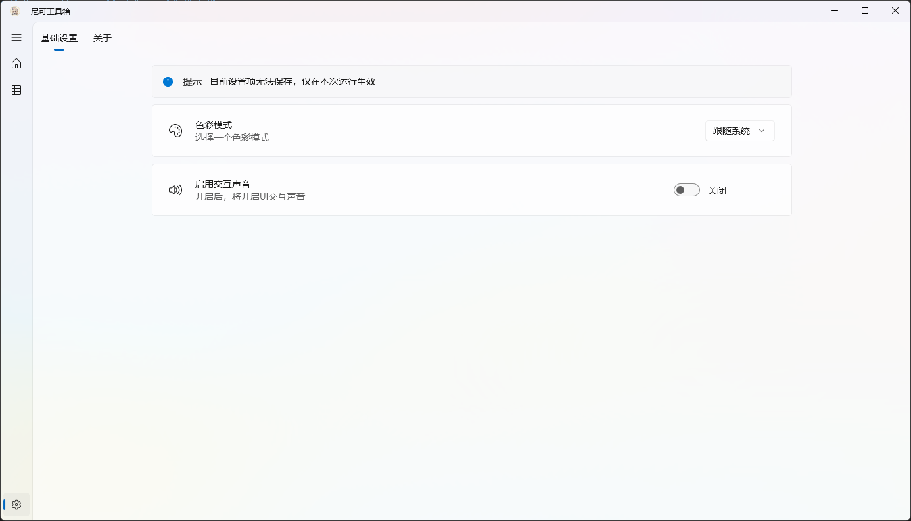
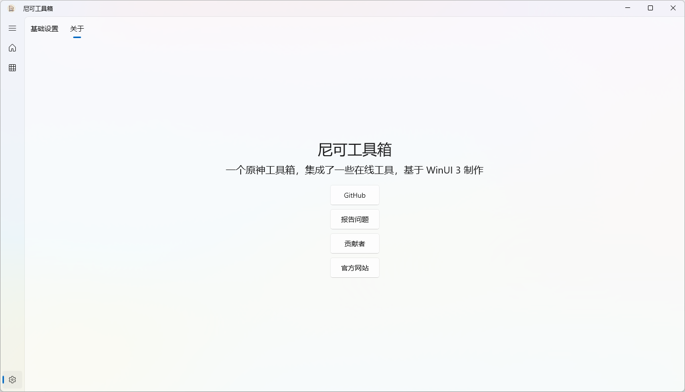

# NicoleToolbox
一个工具箱应用  
使用 .NET 10.0 和 WinUI3 制作  

[应用网站](https://MCFurina.github.io/NicoleToolbox/)  

[获取最新版本](https://github.com/MCFurina/NicoleToolbox/releases)  

# 如何使用？
支持 Windows 10 和 Windows 11，推荐使用 Windows 11 以获得更好的体验。   

使用前请先下载并安装 .NET 10.0！  
[下载 .NET 10.0](https://dotnet.microsoft.com/zh-cn/download/dotnet/10.0)  
SDK 和 .NET 桌面运行时均可运行本应用！请自行选择！   

# 应用画廊
主页  
  
工具页  
  
  
设置  
  
关于  
  
